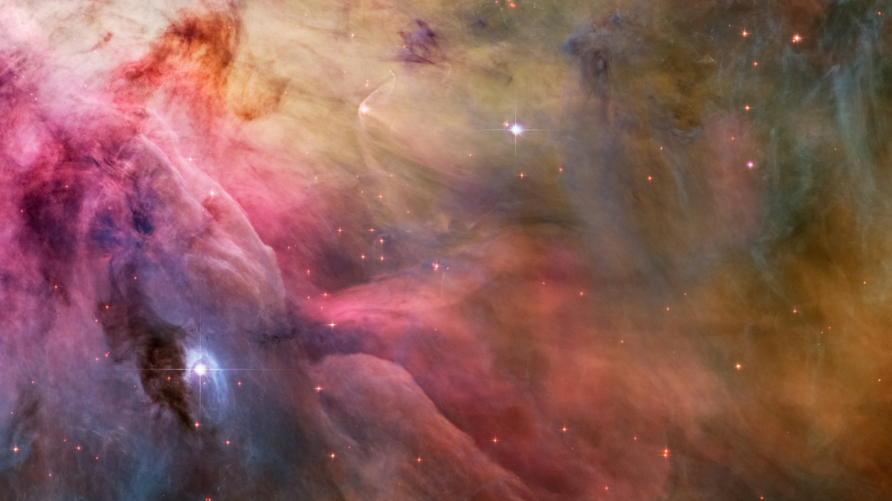

# Del dato a la experiencia: hibridación y mediación en el espacio - *Manovich Reloaded*

#### Aitor Fernández  
#### 20.644 - Cultura Digital - RETO-ACTIVIDAD 3
#### Mayo 2026

## Hacia lo desconocido

## Escuchando lo que no puede oírse

*Figura 1. Imagen de la nebulosa de Orión captada por el telescopio Hubble. Fuente: NASA Unsplash.*

Lorem ipsum dolor sit amet, consectetur adipiscing elit, sed do eiusmod tempor incididunt ut labore et dolore magna aliqua. Ut enim ad minim veniam, quis nostrud exercitation ullamco laboris nisi ut aliquip ex ea commodo consequat. Duis aute irure dolor in reprehenderit in voluptate velit esse cillum dolore eu fugiat nulla pariatur. Excepteur sint occaecat cupidatat non proident, sunt in culpa qui officia deserunt mollit anim id est laborum.

## Vamos calentando motores

Lorem ipsum dolor sit amet, consectetur adipiscing elit, sed do eiusmod tempor incididunt ut labore et dolore magna aliqua. Ut enim ad minim veniam, quis nostrud exercitation ullamco laboris nisi ut aliquip ex ea commodo consequat. Duis aute irure dolor in reprehenderit in voluptate velit esse cillum dolore eu fugiat nulla pariatur. Excepteur sint occaecat cupidatat non proident, sunt in culpa qui officia deserunt mollit anim id est laborum.

*Figura 3. Retransmisión del vuelo 5 de Starship con visualización de telemetría en tiempo real. Fuente: SpaceX.*

Lorem ipsum dolor sit amet, consectetur adipiscing elit, sed do eiusmod tempor incididunt ut labore et dolore magna aliqua. Ut enim ad minim veniam, quis nostrud exercitation ullamco laboris nisi ut aliquip ex ea commodo consequat. Duis aute irure dolor in reprehenderit in voluptate velit esse cillum dolore eu fugiat nulla pariatur. Excepteur sint occaecat cupidatat non proident, sunt in culpa qui officia deserunt mollit anim id est laborum.

### Referencias y Bibliografía

Licencia: Material Creative Commons desarrollado bajo licencia CC BY-SA 4.0.
