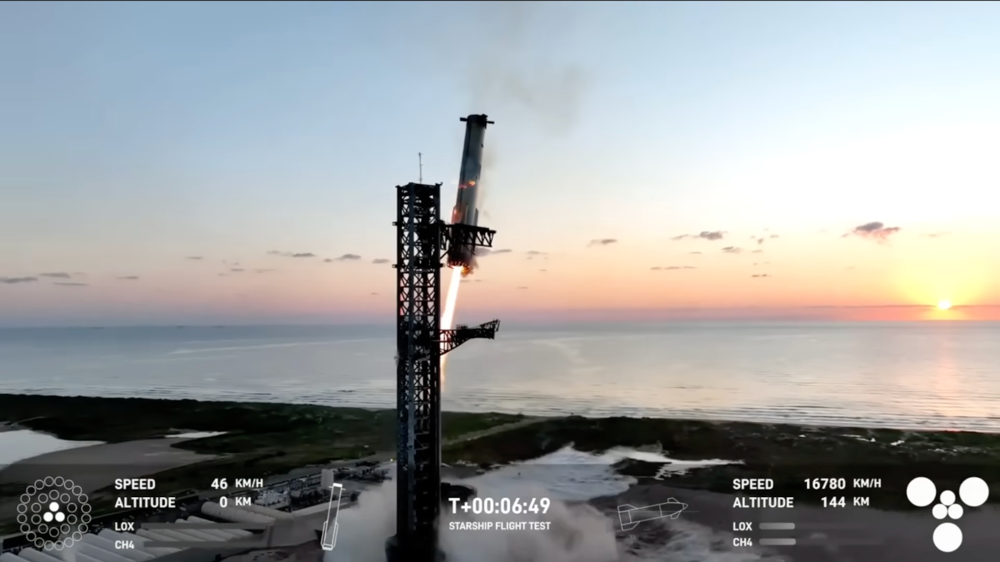

# Del dato a la experiencia: hibridación y mediación en el espacio - *Manovich Reloaded*

#### Aitor Fernández
#### 20.644 - Cultura Digital - RETO-ACTIVIDAD 3
#### Mayo 2026

## T–0

Dos casos, un mismo mecanismo. La **sonificación de datos astronómicos** y la **retransmisión en directo de lanzamientos espaciales** parecen experiencias muy distintas, pero responden a la misma lógica: el **software** fusiona lenguajes que antes existían por separado y genera algo que ninguno podría producir solo. Es lo que **Manovich** (2013) llama hibridación, y lo que emerge, en ambos casos, son **medios completamente nuevos**.

## Escuchando lo que no puede oírse

Me invitaron a experimentar la sensación de ingravidez y terminé vomitando. Leo sobre relatividad general y, cuando descubro que el tiempo puede deformarse, mi mente se desconecta. Entonces, ¿por qué persiste la fascinación por aquello que no logramos comprender?

No solo para entender, sino para **experimentar lo desconocido** de otras formas. Sí, como planteaba Einstein, el espacio-tiempo no es rígido ni fijo, sino dinámico, pero al mismo tiempo *en el espacio nadie puede oír tus gritos* (Alien, 1979), **sonificar el universo no es reproducirlo**: es construir un **medio nuevo** para percibirlo.

*Figura 1. Imagen de la nebulosa de Orión captada por el telescopio Hubble. Fuente: Unsplash (NASA).*

Sabemos hoy que nuestra galaxia es solo una entre cientos de miles de millones en el universo observable, y que cada una contiene, a su vez, cientos de miles de millones de estrellas (Hawking, 1988). Toda esa inmensidad solo podíamos percibirla visualmente, a través de imágenes: telescopios, fotografías, visualizaciones de datos. La **sonificación** cambia eso: es el proceso por el cual **datos astronómicos** —temperaturas, frecuencias de ondas, intensidad de rayos X— se convierten en sonido mediante software. No es una traducción directa, sino una **reinterpretación** que genera una experiencia radicalmente nueva. Y es precisamente en esa fusión entre ciencia, datos y lenguaje sonoro donde Manovich (2013) reconocería un caso claro de **hibridación**.

La **hibridación** no es simplemente la suma de dos medios (Manovich, 2013), sino la **fusión de sus técnicas y lenguajes** en algo totalmente nuevo que no existía antes del software. La sonificación de datos espaciales encaja en esa definición: no combina astronomía y música poniéndolas una al lado de la otra, sino que fusiona la **lógica de la medición científica** con el **lenguaje sonoro** a través del software, generando un **medio nuevo con sus propias reglas**. El resultado no permite *escuchar el espacio* en sentido literal, sino experimentar una interpretación mediada por decisiones de diseño: qué variable controla la frecuencia, qué variable controla la intensidad, a qué velocidad transcurre el tiempo sonoro. En ese sentido, la hibridación aquí no es solo **técnica** sino también **cultural**, definiendo qué aspectos de la experiencia se vuelven perceptibles y cuáles quedan en silencio.

El universo no es rígido: está en expansión, en movimiento. Y la sonificación hace perceptible esa naturaleza dinámica de una forma que la imagen estática no puede. El compositor Mark Ballora (2017) describe cómo ha convertido en música datos de viento solar, terremotos solares u ondas gravitacionales —fenómenos físicos que nunca fueron sonido— generando en el oyente una **comprensión visceral e intuitiva** que la representación visual no alcanza. No se trata de añadir sonido a una imagen, sino de fusionar la lógica científica de la medición con el lenguaje sonoro en un **único medio nuevo**.

[Ver vídeo de sonificación del Bullet Cluster (YouTube)](https://www.youtube.com/watch?v=J7STY_H0BEk)

*Figura 2. Sonificación del Bullet Cluster. Los datos de rayos X y materia oscura se transforman en sonido según su frecuencia y posición. Fuente: NASA.*

Esta lógica se hace especialmente visible en los proyectos de sonificación de la NASA. En el *Bullet Cluster*, los datos de materia oscura se asignaron a las frecuencias más bajas, los rayos X a las más altas, y las galaxias visibles a un rango intermedio. En la Nebulosa del Cangrejo, cada longitud de onda se emparejó con una familia de instrumentos distinta: los rayos X de Chandra con metales, los datos ópticos de Hubble con cuerdas y los infrarrojos de Spitzer con maderas. En el Cúmulo de Perseo, la onda de presión de un agujero negro supermasivo —un sí bemol 57 octavas por debajo del do central— fue transpuesta hasta el rango audible (Arcand et al., 2020). En todos los casos, **el software no descubre; construye**.

Y esa construcción nunca es neutral. Cada decisión de ***mapping*** —qué variable controla la frecuencia, qué variable controla la intensidad, a qué velocidad transcurre el tiempo sonoro— determina qué patrones se vuelven perceptibles y cuáles quedan sepultados en el silencio. La jerarquía grave-agudo del *Bullet Cluster* no está en los datos, sino en quien diseña el *mapping*. Como apunta Arcand (2025), el proceso de sonificación se asemeja a una traducción entre idiomas: siempre implica **decisiones interpretativas** que alejan el resultado de una correspondencia exacta con los datos originales. Cuando optamos por tonos más graves, ritmos más rápidos o estructuras más "musicales", estamos tomando **decisiones estéticas disfrazadas de decisiones técnicas**. ¿Dónde termina el dato y empieza la interpretación?

Si dos equipos distintos sonifican el mismo agujero negro, ¿estamos escuchando el mismo fenómeno? ¿Por qué suena grave, por qué tiene ese ritmo, por qué es continuo o pulsado? Nada de eso está en los datos en sí, sino en las decisiones de interfaz que los hacen perceptibles.

Con los mismos datos pueden construirse experiencias radicalmente distintas, lo que evidencia que no accedemos al fenómeno directamente, sino a su **interpretación computacional**. La sonificación no revela el espacio: **define cómo puede ser experimentado**. Y es precisamente ahí, en esa fusión entre **dato científico**, **lenguaje sonoro** y **decisión cultural mediada por software**, donde Manovich (2013) sitúa el núcleo de la hibridación, una **estética híbrida** que reconfigura lo que percibimos.

## Vamos calentando motores

*That's one small step for man, one giant leap for mankind.* La frase de Armstrong quedó como símbolo de una época, pero también, tristemente, como cierre de los programas que la NASA abandonó tras la Guerra Fría. Durante años, los lanzamientos espaciales dejaron de sentirse como algo vivo, reducidos a eventos técnicos o retransmisiones planas sin **mediación cultural**.

*Figura 3. Retransmisión del vuelo 5 de Starship con visualización de telemetría en tiempo real. Fuente: SpaceX.*

Desde mi experiencia siguiendo webcasts de eventos tecnológicos y lanzamientos espaciales, lo que busco cuando veo un lanzamiento de Starship no es solo observar un cohete, sino cómo ese lanzamiento **se construye en pantalla**. El foco está en el *webcast* oficial de SpaceX, emitido en directo a través de su canal de YouTube, con millones de espectadores simultáneos en cada prueba de vuelo. No es una retransmisión convencional, sino una **interfaz compleja** en la que distintas capas confluyen en tiempo real; el *webcast* se convierte así en la forma de experimentar el lanzamiento.

Busco sentir el lanzamiento: la tensión, la incertidumbre, la posibilidad de fallo. Y es precisamente ahí donde aparece algo distinto. Al igual que en la sonificación, no se trata de acceder al fenómeno de forma directa, sino de cómo **el software transforma los datos en experiencia** y decide cómo se presenta.

Aunque el lanzamiento de Starship debería ser el protagonista, acaba pasando a segundo plano, como cuando un actor secundario eclipsa al principal. La atención se desplaza hacia otros elementos: los números en pantalla, la interfaz —altitud, velocidad, presión, esquemas del vehículo, indicadores dinámicos— y los **datos de telemetría en tiempo real**. A esto se suman otras capas: las cámaras *onboard*, los comentaristas técnicos, la gente en la sala de control, las comunicaciones de *CAPCOM*, el público en las zonas de observación y también los chats en directo. **Lo que antes era relleno se ha convertido en el propio medio**.

Todo eso construye el verdadero centro de la experiencia. Es un ejemplo claro de lo que plantea Manovich (2013): no es que convivan varios medios, es que **se fusionan hasta crear algo que ninguno podría generar por sí solo**. El *webcast* de SpaceX no es televisión, ni videojuego, ni telemetría técnica: es un **híbrido** que solo existe porque el software permite ensamblar todas esas capas en tiempo real. Los datos, la narrativa, el *streaming* y el público no están uno al lado del otro. **Son el mismo medio**.

He mencionado algunos datos, pero merece la pena detenerse en ellos: cómo dejan de ser invisibles para convertirse en una capa cultural que estructura la forma en que son percibidos. Lo que en otros contextos sería información compleja o técnica aquí resulta familiar. **El software ha hecho visible lo invisible.**

Estos datos, convertidos en elementos visuales —altitud, velocidad, presión—, funcionan como un ***Heads-Up Display*** (HUD) que completa la experiencia. Como desarrollador de software, reconozco en esta capa un patrón familiar: no son solo información, son **interfaz**: una capa que organiza cómo el espectador accede a los datos y los convierte en experiencia. Pero, a diferencia de otros HUDs, este no representa una simulación, **representa algo que está ocurriendo de verdad**.

[Ver vídeo: Starship pierde el control durante el vuelo de prueba (YouTube)](https://www.youtube.com/watch?v=OvGdjzbTl1k&t=45s)

*Figura 4. Starship pierde el control durante su octavo vuelo de prueba, entrando en rotación y perdiendo contacto tras la separación del booster. Fuente: YouTube.*

La **hibridación** que introduce este HUD no es decorativa: **fusiona el lenguaje visual de los videojuegos con datos de ingeniería real**. En un videojuego, el HUD forma parte de una simulación; sabemos que lo que vemos no es real. Aquí ocurre lo contrario: el HUD representa un sistema físico en funcionamiento. Una pérdida de señal o una altitud inconsistente con lo esperado no son elementos visuales, sino indicios de que algo puede estar fallando.

Esa condición transforma la experiencia. El espectador no solo observa, sino que **interpreta señales en tiempo real**, como si leyera el estado de un sistema vivo. Esa experiencia se completa con la retransmisión en *streaming* y el chat en directo, donde miles de personas participan simultáneamente. La experiencia deja de ser individual: **se convierte en algo que se vive con una comunidad**.

*It's not rocket science* deja de tener sentido aquí. Tanto en la sonificación como en la retransmisión de Starship, **el mecanismo de hibridación es el mismo**: el software fusiona lenguajes que antes existían por separado —la medición científica y el sonido, la telemetría y el videojuego— generando experiencias que ninguno de esos lenguajes podría producir por sí solo (Manovich, 2013). En ambos casos, no accedemos directamente al fenómeno, sino a través de **capas que lo hacen perceptible y, al hacerlo, lo reconfiguran**. No es necesario entenderlo todo para experimentarlo. Quizá ahí reside el verdadero *giant leap for mankind*: no en el acceso al conocimiento en sí, sino en la forma en que **el software construye nuestra experiencia de lo desconocido**.

### Referencias y Bibliografía

- Arcand, K., Russo, M., y Santaguida, A. (2020). *Data sonification: A new cosmic triad of sound*. NASA.
  https://www.nasa.gov/universe/data-sonification-a-new-cosmic-triad-of-sound/

- Arcand, K. (2025, 20 de agosto). Turning space data into sound [episodio de podcast]. En A. Almeida (presentador), *Small Steps, Giant Leaps* (ep. 160). NASA.
  https://www.nasa.gov/podcasts/small-steps-giant-leaps/small-steps-giant-leaps-episode-160-turning-space-data-into-sound/

- Ballora, M. (2017). *Meet the scientist who turns data into music*.
  https://www.science.org/content/article/meet-scientist-who-turns-data-music-and-listen-sound-neutron-star

- Hawking, S. (1988/2010). *Historia del tiempo*. Editorial Crítica.

- Manovich, L. (2013). *El software toma el mando*. UOC Press.

---

Licencia: Material Creative Commons desarrollado bajo licencia CC BY-SA 4.0.
